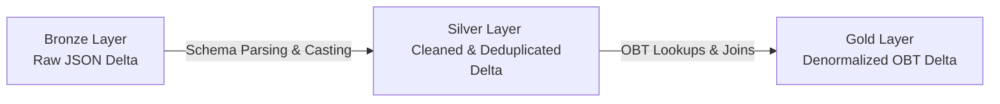

# Veyro: End-to-End Real-Time Stream-to-Report Pipeline

This repository contains the full source code, data transformations, and report definitions for **Veyro** (pronounced *VAY-ro*), a production-grade streaming data platform.

---

## 🔗 Live Interactive Dashboard
Explore the live, interactive Power BI report for this streaming pipeline here:
👉 **[Live Veyro Power BI Report](https://app.powerbi.com/view?r=eyJrIjoiYmY2MmVmNGEtNDY0NC00MWQxLWJkOTctYzY5MzhjNTJhNTBlIiwidCI6ImM2ZTU0OWIzLTVmNDUtNDAzMi1hYWU5LWQ0MjQ0ZGM1YjJjNCJ9)**

---

## 📥 1. Source: Real-Time Event Generation
The data originates from the **Veyro Ride-Booking Application**:
*   **Veyro Event Simulator**: A Python-based FastAPI web application that simulates a dynamic ride-hailing service (similar to Uber). 
*   **Data Generation**: The application uses the `Faker` library to generate live passenger records, calculate distance-based fares, apply random surge multipliers (ranging from 1.0x to 2.5x), capture geocoordinates, and log ride statuses (Completed, Cancelled).
*   **Streaming Ingestion**: The simulated booking events are pushed instantly as JSON payloads using the **Azure Event Hubs Python SDK** into a Kafka-compatible Azure Event Hubs namespace with sub-second latency.

---

## ⚡ 2. Transformation: Databricks & ADF Medallion Refining
The raw payloads are refined through a Databricks Medallion Architecture, optionally orchestrated by Azure Data Factory (ADF):

*   **Bronze Layer (Raw Storage)**: Establishes a structured stream from Event Hubs into Azure Databricks. The raw JSON payloads are written directly into ADLS Gen2 Delta format with checkpointing enabled to guarantee *at-least-once* ingestion.
*   **Silver Layer (Cleaned & Validated)**: 
    *   Parses the raw JSON string fields into defined columns using explicit Spark schemas (`from_json`).
    *   Standardizes timestamps, sanitizes null ratings, and enforces types.
    *   Applies a 15-minute Spark Watermark (`withWatermark`) on transaction timestamps to filter out duplicate booking payloads.
*   **Gold Layer & Databricks Output**: 
    *   **The Output of Databricks** is a highly optimized, denormalized **One Big Table (OBT)** Delta Lake table (joining Silver transactions with lookup dimensions like drivers, payments, and cities).
    *   This flat, denormalized model is exposed via a **Databricks SQL Warehouse**, providing DirectQuery endpoint access with zero data duplication and blazing-fast query speeds.

---

## 📊 3. Reporting: Agentic Power BI Development
This project showcases a modern **Developer-First / Agentic approach** to BI. Instead of manually dragging and dropping charts in the Power BI Desktop client, the entire semantic model and the 4-page dashboard were built programmatically using custom **Claude Power BI Agent Skills** targeting the `.pbip` project file format:

*   **`powerbi-connect` (Instance Discovery)**: Automatically discovered the active local Power BI Desktop Analysis Services port and connected to the tabular model.
*   **`powerbi-datamodelling` (Semantic & DAX Development)**: 
    *   Programmatically defined star-schema relationships.
    *   Injected custom DAX Calculated Columns (`Ride Status`, `Payment Method`, `Cancellation Reason`, and chronological `Month Name` sorting).
    *   Created core KPI measures (Total Rides, Total Revenue, Avg Fare, Total Tips, Avg Rating).
*   **`powerbi-reporting` (Layout Engineering)**:
    *   Automatically built the report page hierarchies and visual layout files (`visual.json` structures) for a 4-tab dashboard:
        *   **Executive Overview**
        *   **Trips & Bookings**
        *   **Driver & Vehicle Performance**
        *   **Passenger & Financial Insights**
*   **`powerbi-beautify` (Visual Polish & Theme Automation)**:
    *   Programmed a premium **dark mode theme** directly into the Power BI base theme JSON (`CY26SU05.json`), setting page backgrounds to `#121214` and cards to `#2A2B2E`.
    *   Styled all KPI cards to charcoal-blue inserts (`#1E1F22` with a `#1A73E8` blue border), setting values to `24pt DIN` and labels to `9pt Segoe UI` for advanced data-density visualization.
