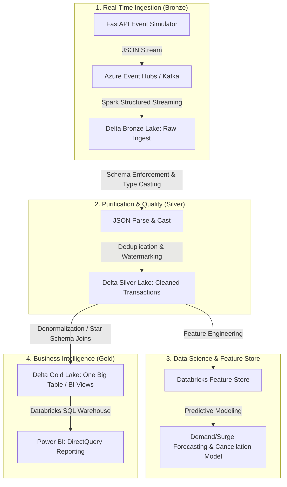

# Veyro: Real-Time Data Engineering & Streaming Project


This repository contains a production-grade end-to-end real-time streaming data pipeline named **Veyro** (pronounced *VAY-ro*). The platform simulates a ride-booking transaction system (similar to Uber) to demonstrate real-time ingestion, stream processing, schema enforcement, and denormalized analytical modeling.

---

## 🔗 Interactive Power BI Analytics
Explore the live, interactive Power BI analytical report for this streaming pipeline here:
👉 **[Live Veyro Power BI Report](https://app.powerbi.com/view?r=eyJrIjoiYmY2MmVmNGEtNDY0NC00MWQxLWJkOTctYzY5MzhjNTJhNTBlIiwidCI6ImM2ZTU0OWIzLTVmNDUtNDAzMi1hYWU5LWQ0MjQ0ZGM1YjJjNCJ9)**

---

## 📐 Professional End-to-End Lakehouse Architecture (Data Scientist & Engineer Perspective)
As a Data Scientist/Databricks Engineer, we structure this end-to-end real-time project using the **Delta Lake Lakehouse Medallion Architecture**, separating concerns across ingestion, purification, machine learning preparation, and serving:



### Phase-by-Phase Execution:
1.  **Phase 1: Ingestion & Live Data Capture (Bronze)**
    *   **Live Events**: User interactions in the FastAPI app trigger ride requests. The Python Event Hubs SDK streams events asynchronously with microsecond latency.
    *   **Bronze Ingestion**: Databricks runs a Spark Structured Streaming job that reads directly from the Event Hub. Payloads are appended raw to Delta storage with check-pointing to guarantee *exactly-once* or *at-least-once* write semantics.
2.  **Phase 2: Cleaning, Validation & Deduplication (Silver)**
    *   **Schema Enforcement**: Raw JSON string values are parsed using explicit Spark schemas (`from_json`) and cast to exact data types (timestamps, decimals, integers).
    *   **Data Quality**: Cleans invalid or null passenger ratings and enforces business constraints.
    *   **Stream Deduplication**: Employs watermarking (`withWatermark`) on `booking_timestamp` to automatically ignore late-arriving duplicate events within a 15-minute window.
3.  **Phase 3: Feature Store & Machine Learning (Data Science Layer)**
    *   **Feature Engineering**: The clean Silver data is used to generate features such as historical passenger tip ratios, vehicle rating averages, rolling traffic speed metrics, and surge multiplier trends.
    *   **Model Training**: Databricks MLflow tracks models trained on these features to predict ride cancellations and forecast peak demand surge.
4.  **Phase 4: Serving & Interactive Business Intelligence (Gold)**
    *   **Dimensional Modeling**: The Silver transactions fact table is joined with static dimensional tables (`dim_passenger`, `dim_driver`, `dim_city`, `dim_payment`) to form a high-performance **One Big Table (OBT)** or Star Schema.
    *   **BI Connectivity**: The Gold Delta tables are exposed via a Databricks SQL Warehouse. Power BI connects via **DirectQuery** to serve live interactive dashboards with zero data movement or latency.

---

## 🚀 Key Patterns & Features

*   **Real-Time Event Generation:** A serverless FastAPI portal that simulates dynamic ride bookings, generating mock records using `Faker` (passenger details, fare calculations, surge multipliers, geographical coordinates).
*   **Asynchronous Streaming Ingestion:** Low-latency ingestion using the Azure Event Hubs Python SDK to stream booking payloads directly to a Kafka-compatible message broker.
*   **Medallion Architecture (Delta Lake):**
    *   **Bronze Layer:** Append-only ingestion of raw JSON payloads directly from Event Hubs into ADLS Gen2 Delta format.
    *   **Silver Layer:** Dynamic JSON schema parsing, type casting, data cleaning (handling null ratings, sanitizing timestamps), and watermark-based event deduplication.
    *   **Gold Layer (One Big Table - OBT):** Joins transaction facts with dimensional map configurations to build a single flat OBT model optimized for BI reports.
*   **Serverless Production Deployment:** Deployed to Firebase Hosting integrated with Gen 2 Firebase Python Functions using an `a2wsgi` ASGI-to-WSGI compatibility adapter.

---

## 📁 Repository Structure

The project resources are structured logically by layer:
*   [**`/Code_Files`**](./Code_Files): PySpark and SQL definitions for Databricks stream processing (Bronze, Silver, Gold OBT).
*   [**`/templates`**](./templates): HTML5 and Jinja2 frontend components for the FastAPI portal.
*   [**`/Data`**](./Data): Static lookup mappings (cities, payments, vehicle types) and local booking cache.
*   [**`api.py`**](./api.py) & [**`main.py`**](./main.py): Application entry points for local run and Firebase Cloud Functions.
*   [**`data.py`**](./data.py) & [**`connection.py`**](./connection.py): Ride event simulator and Event Hub connection client.
*   [**`Veyro.Report`**](./Veyro.Report): Power BI Desktop report pages and visual layouts definitions.
*   [**`Veyro.SemanticModel`**](./Veyro.SemanticModel): Power BI tabular model definitions, tables, and relationships.

---

## 🛠️ Pipeline Details

### 1. Event Producer App (`api.py` & `main.py`)
Serves the dynamic ride booking user interface.
*   **Workflow:**
    1.  User enters pickup/dropoff location or selects custom parameters.
    2.  `data.py` calculates distance-based fare, applies random surge multipliers (1.0x to 2.5x), and structures the ride metadata.
    3.  `connection.py` establishes connection with Azure Event Hubs using connection strings and shoots the event.
    4.  Simultaneously saves the booking locally to `Data/local_bookings.json` for validation.

### 2. Bronze Ingestion Pipeline (`bronze_adls.ipynb`)
Performs real-time raw stream capturing.
*   **Workflow:**
    1.  Establishes a connection to Azure Event Hubs from Databricks using the Event Hubs Spark connector.
    2.  Reads the streaming source bytes.
    3.  Writes the stream raw payload into the Bronze container in Delta Lake format with checkpointing enabled.

### 3. Silver & Gold OBT Pipeline (`silver_obt.ipynb` & `silver_obt.sql`)
Cleans transactions and prepares denormalized serving tables.
*   **Workflow:**
    1.  Reads the streaming Delta table from the Bronze folder.
    2.  Applies schema parsing to extract structured columns from the JSON body.
    3.  Cleans columns, enforces correct datatypes, handles null entries, and filters late-arriving events.
    4.  Performs joins against static dimensions (`map_cities`, `map_payment_methods`, `map_vehicle_types`) to generate a single denormalized **One Big Table (OBT)**.
    5.  Outputs the Gold table in Delta format, ready for Power BI consumption.

---

## ⚙️ Setup & Execution Guide

### 1. Local Run Configuration
1.  **Activate Virtual Environment:**
    ```powershell
    .\venv\Scripts\activate
    ```
2.  **Install Dependencies:**
    ```powershell
    pip install -r requirements.txt
    ```
3.  **Configure Environment Variables (`.env`):**
    ```env
    CONNECTION_STRING="Endpoint=sb://<your-eventhub-namespace>.servicebus.windows.net/;SharedAccessKeyName=Sendpolicy;SharedAccessKey=<your-key>;EntityPath=<your-topic>"
    EVENT_HUBNAME="<your-topic>"
    ```
4.  **Run FastAPI Locally:**
    ```powershell
    python api.py
    ```
    Access the portal at `http://localhost:8000`.

---

## 🛠️ Programmatic Power BI Modeling (Agentic Development)
The underlying semantic model and the 4-tab report layout were generated programmatically using a set of agentic skills designed for Power BI Developer tools:

1. **`powerbi-connect` (Connection & Discovery)**:
   * Discovered the local Power BI Desktop SSAS tabular instance port and connected to the database model dynamically.
2. **`powerbi-datamodelling` (Semantic Modeling & DAX)**:
   * Built the semantic star-schema relationships.
   * Created custom business calculated columns (e.g., `Ride Status`, `Payment Method`, `Cancellation Reason`, and chronological `Month Name` sorting).
   * Programmed essential measures (Rides, Revenue, Average Fare, Ratings, Distance, Duration, and Tips).
3. **`powerbi-reporting` (Page & Visual Layout Generation)**:
   * Scaffolded a 4-tab detailed analytical interface targeting different user audiences (Executive Overview, Trips & Bookings, Driver & Vehicle Performance, and Passenger & Financial Insights).
4. **`powerbi-beautify` (Advanced Styling & Dark Mode)**:
   * Configured a custom dark-mode theme directly in the base theme file (`CY26SU05.json`).
   * Applied slate card container styling with accent blue visual highlights and precise, high-readability typography defaults.
