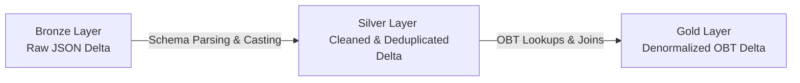

# Veyro: End-to-End Real-Time Stream-to-Report Pipeline


This repository contains the full source code, data transformations, and report definitions for **Veyro** (pronounced *VAY-ro*), a production-grade streaming data platform.

---

## 🔗 Live Interactive Dashboard
Explore the live, interactive Power BI report for this streaming pipeline here:
👉 **[Live Veyro Power BI Report](https://app.powerbi.com/view?r=eyJrIjoiYmY2MmVmNGEtNDY0NC00MWQxLWJkOTctYzY5MzhjNTJhNTBlIiwidCI6ImM2ZTU0OWIzLTVmNDUtNDAzMi1hYWU5LWQ0MjQ0ZGM1YjJjNCJ9)**

---

## 🚀 Key Patterns & Features

*   **Real-Time Event Generation:** A serverless FastAPI portal that simulates dynamic ride bookings, generating mock records using `Faker` (passenger details, fare calculations, surge multipliers, geographical coordinates).
*   **Asynchronous Streaming Ingestion:** Low-latency ingestion using the Azure Event Hubs Python SDK to stream booking payloads directly to a Kafka-compatible message broker.
*   **Medallion Architecture (Delta Lake):**
    *   **Bronze Layer:** Append-only ingestion of raw JSON payloads directly from Event Hubs into ADLS Gen2 Delta format.
    *   **Silver Layer:** Dynamic JSON schema parsing, type casting, data cleaning (handling null ratings, sanitizing timestamps), and watermark-based event deduplication.
    *   **Gold Layer (One Big Table - OBT):** Joins transaction facts with dimensional lookup configurations to build a single flat OBT model optimized for BI reports.
*   **Serverless Production Deployment:** Deployed to Firebase Hosting integrated with Gen 2 Firebase Python Functions using an `a2wsgi` ASGI-to-WSGI compatibility adapter.

---

## 📁 Repository Structure

The project resources are structured logically by layer:
*   [**`/Code_Files`**](./Code_Files): PySpark and SQL definitions for Databricks stream processing (Bronze, Silver, Gold OBT).
*   [**`/templates`**](./templates): HTML5 and Jinja2 frontend components for the FastAPI portal.
*   [**`/Data`**](./Data): Static lookup mappings (cities, payments, vehicle types) and local booking cache.
*   [**`api.py`**](./api.py) & [**`main.py`**](./main.py): Application entry points for local run and Firebase Cloud Functions.
*   [**`data.py`**](./data.py) & [**`connection.py`**](./connection.py): Ride event simulator and Event Hub connection client.
*   [**`Veyro.Report`**](./Veyro.Report): Power BI Desktop report pages and visual layouts definitions.
*   [**`Veyro.SemanticModel`**](./Veyro.SemanticModel): Power BI tabular model definitions, tables, and relationships.

---

## 📥 1. Source: Real-Time Event Generation & Ingestion
The data is generated and ingested using the following components:
*   **Veyro Event Simulator**: A Python-based FastAPI web application that simulates a dynamic ride-hailing service (similar to Uber). 
*   **Data Generation**: The application uses the `Faker` library to generate live passenger records, calculate distance-based fares, apply random surge multipliers (ranging from 1.0x to 2.5x), capture geocoordinates, and log ride statuses (Completed, Cancelled).
*   **Azure Data Factory (ADF)**: Acts as the primary orchestrator. ADF pipelines trigger the event simulator, monitor ingestion health, schedule jobs, and orchestrate the flow of data from raw events into cloud storage.
*   **Streaming Ingestion**: The simulated booking events are pushed instantly as JSON payloads using the **Azure Event Hubs Python SDK** into a Kafka-compatible Azure Event Hubs namespace with sub-second latency.

---

## ⚡ 2. Transformation: Databricks Medallion Refining
The raw payloads are refined through a Databricks Medallion Architecture:



*   **Bronze Layer (Raw Storage)**: Establishes a structured stream from Event Hubs into Azure Databricks. The raw JSON payloads are written directly into ADLS Gen2 Delta format with checkpointing enabled to guarantee *at-least-once* ingestion.
*   **Silver Layer (Cleaned & Validated)**: 
    *   Parses the raw JSON string fields into defined columns using explicit Spark schemas (`from_json`).
    *   Standardizes timestamps, sanitizes null ratings, and enforces types.
    *   Applies a 15-minute Spark Watermark (`withWatermark`) on transaction timestamps to filter out duplicate booking payloads.
*   **Gold Layer & Databricks Output**: 
    *   **The Output of Databricks** is a highly optimized, denormalized **One Big Table (OBT)** Delta Lake table (joining Silver transactions with lookup dimensions like drivers, payments, and cities).
    *   This flat, denormalized model is exposed via a **Databricks SQL Warehouse**, providing DirectQuery endpoint access with zero data duplication and blazing-fast query speeds.

### 🛠️ Detailed Pipeline Steps:
#### A. Event Producer App (`api.py` & `main.py`)
Serves the dynamic ride booking user interface.
*   **Workflow:**
    1.  User enters pickup/dropoff location or selects custom parameters.
    2.  `data.py` calculates distance-based fare, applies random surge multipliers (1.0x to 2.5x), and structures the ride metadata.
    3.  `connection.py` establishes connection with Azure Event Hubs using connection strings and shoots the event.
    4.  Simultaneously saves the booking locally to `Data/local_bookings.json` for validation.

#### B. Bronze Ingestion Pipeline (`bronze_adls.ipynb`)
Performs real-time raw stream capturing.
*   **Workflow:**
    1.  Establishes a connection to Azure Event Hubs from Databricks using the Event Hubs Spark connector.
    2.  Reads the streaming source bytes.
    3.  Writes the stream raw payload into the Bronze container in Delta Lake format with checkpointing enabled.

#### C. Silver & Gold OBT Pipeline (`silver_obt.ipynb` & `silver_obt.sql`)
Cleans transactions and prepares denormalized serving tables.
*   **Workflow:**
    1.  Reads the streaming Delta table from the Bronze folder.
    2.  Applies schema parsing to extract structured columns from the JSON body.
    3.  Cleans columns, enforces correct datatypes, handles null entries, and filters late-arriving events.
    4.  Performs joins against static dimensions (`map_cities`, `map_payment_methods`, `map_vehicle_types`) to generate a single denormalized **One Big Table (OBT)**.
    5.  Outputs the Gold table in Delta format, ready for Power BI consumption.

---

## 📊 3. Reporting: Agentic Power BI Development
This project showcases a modern **Developer-First / Agentic approach** to BI. Instead of manually dragging and dropping charts in the Power BI Desktop client, the entire semantic model and the 4-page dashboard were built programmatically using custom **Claude Power BI Agent Skills** targeting the `.pbip` project file format:

*   **`powerbi-connect` (Instance Discovery)**: Automatically discovered the active local Power BI Desktop Analysis Services port and connected to the tabular model.
*   **`powerbi-datamodelling` (Semantic & DAX Development)**: 
    *   Programmatically defined star-schema relationships.
    *   Injected custom DAX Calculated Columns (`Ride Status`, `Payment Method`, `Cancellation Reason`, and chronological `Month Name` sorting).
    *   Created core KPI measures (Total Rides, Total Revenue, Avg Fare, Total Tips, Avg Rating).
*   **`powerbi-reporting` (Layout Engineering)**:
    *   Automatically built the report page hierarchies and visual layout files (`visual.json` structures) for a 4-tab dashboard:
        *   **Executive Overview**
        *   **Trips & Bookings**
        *   **Driver & Vehicle Performance**
        *   **Passenger & Financial Insights**
*   **`powerbi-beautify` (Visual Polish & Theme Automation)**:
    *   Programmed a premium **dark mode theme** directly into the Power BI base theme JSON (`CY26SU05.json`), setting page backgrounds to `#121214` and cards to `#2A2B2E`.
    *   Styled all KPI cards to charcoal-blue inserts (`#1E1F22` with a `#1A73E8` blue border), setting values to `24pt DIN` and labels to `9pt Segoe UI` for advanced data-density visualization.

---

## ⚙️ Setup & Execution Guide

### 1. Local Run Configuration
1.  **Activate Virtual Environment:**
    ```powershell
    .\venv\Scripts\activate
    ```
2.  **Install Dependencies:**
    ```powershell
    pip install -r requirements.txt
    ```
3.  **Configure Environment Variables (`.env`):**
    ```env
    CONNECTION_STRING="Endpoint=sb://<your-eventhub-namespace>.servicebus.windows.net/;SharedAccessKeyName=Sendpolicy;SharedAccessKey=<your-key>;EntityPath=<your-topic>"
    EVENT_HUBNAME="<your-topic>"
    ```
4.  **Run FastAPI Locally:**
    ```powershell
    python api.py
    ```
    Access the portal at `http://localhost:8000`.
